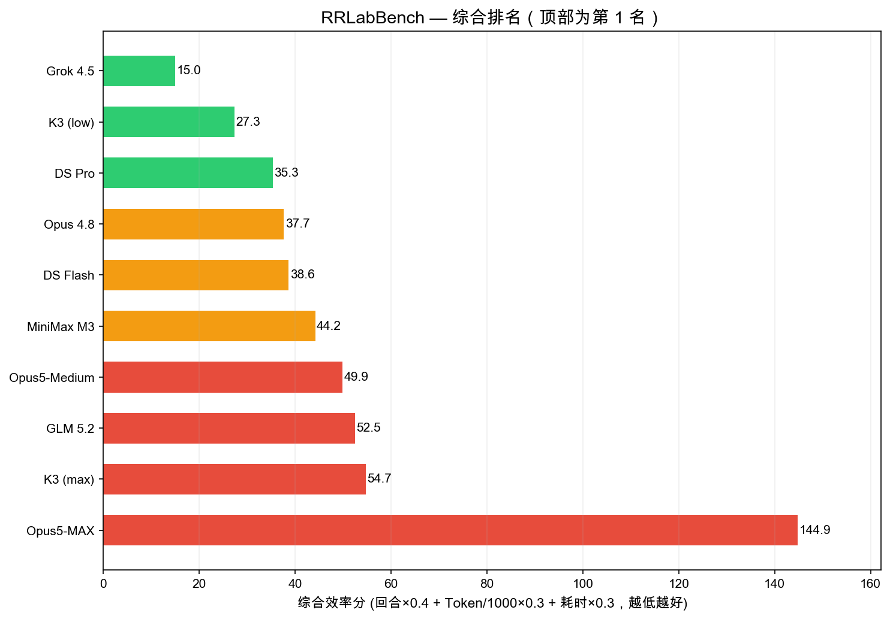
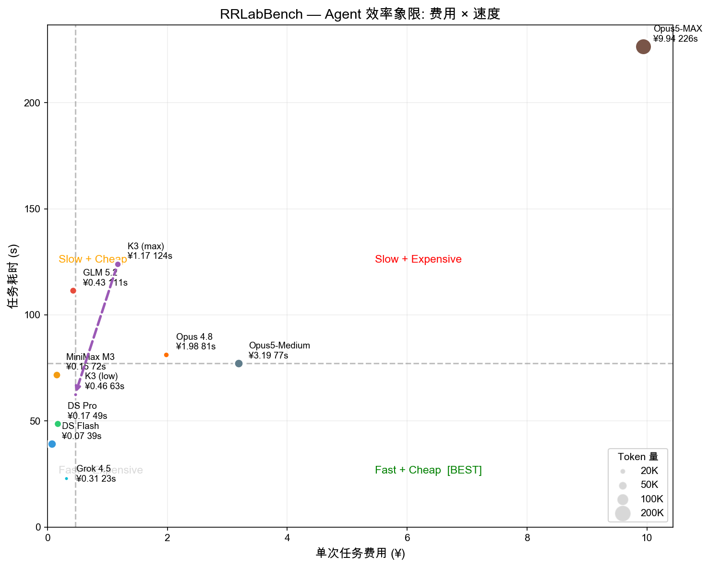
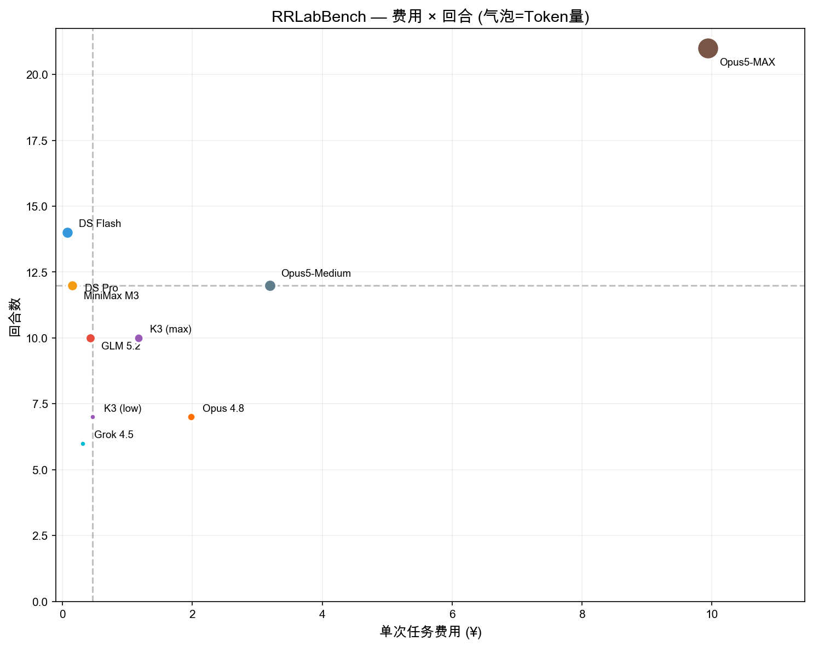

# RRLabBench

> Real capability isn't on leaderboards. It's in the cost of getting things done.

English | [中文](README_CN.md)

[](https://www.python.org/)
[](LICENSE)

## What is this

RRLabBench is an **agent capability audit framework** for code modification tasks. It doesn't rank models. It answers two engineering questions:

1. **Regression Risk (FRR)**: After the model modifies your code, do the existing tests still pass?
2. **Efficiency**: Given the same output quality, which model is faster, cheaper, and uses fewer tokens?

### Why this matters

LLM leaderboards tell you which model is "smartest." RRLabBench tells you which model fits your agent workflow — and these are different things. A model that aces benchmarks can still burn 10x the tokens doing the same job in your `pip install` environment.

### What we found

We audited 9 models and discovered three uncomfortable facts:

**1. Parameter count ≠ agent efficiency**

Every model produced identical output quality (FRR = 0% across the board). But the cost of doing the same work varied wildly: the fastest model took 6 turns, 23 seconds, ¥0.31. The slowest took 21 turns, 226 seconds, ¥9.94 — **32x the cost, same result.**

**2. Deep thinking is a liability in agent workflows**

Opus 5 at MAX thinking exhibited "compulsive self-verification" — repeated re-checks, verbose internal reasoning — producing the same result as MEDIUM thinking at 3x the cost. In exams, deeper thinking helps. In agents, every unnecessary reasoning turn is the user's time and money.

**3. Leaderboards optimize for the wrong thing**

Models optimized for benchmark accuracy systematically underperform on user-relevant metrics like speed and cost. This gap is not a flaw in any single model — it's a flaw in how we evaluate them.

> A model's benchmark scores don't reflect how it performs when you actually use it.

## Quick start

### Install

```bash
git clone https://github.com/rrlab-tech/rrlab-bench.git
cd rrlab-bench
pip install -e .
```

### API Keys

```bash
# DeepSeek
export DEEPSEEK_API_KEY=sk-xxx

# OpenRouter (Claude, GLM, MiniMax, Grok, etc.)
export OPENROUTER_API_KEY=sk-or-v1-xxx

# Kimi
export KIMI_API_KEY=sk-xxx
```

### Run

```bash
# Single scenario
rrlab-bench audit --model deepseek-v4-pro --scenario refactor-api --runs 3

# All three scenarios
rrlab-bench audit --model deepseek-v4-pro --all-scenarios --runs 3

# Short alias
rrlab-bench run --model kimi-k3 --all-scenarios
```

### Example output

```
🔬 RRLabBench v0.3 | refactor-api | deepseek-v4-pro ×3
   [1/3] ✅ FRR=0% turn=12 43.2s ¥0.17
   [2/3] ✅ FRR=0% turn=12 51.0s ¥0.17
   [3/3] ✅ FRR=0% turn=12 54.3s ¥0.18

📊 Summary (3/3 runs)
   FRR median:     0.0%
   Code broken:    0/3
   Avg turns:      12.0
   Avg time:       49.5s
   Avg tokens:     53,000
   Avg cost:       ¥0.17
```

## Scenarios

Three scenarios covering common risks in real-world agent coding tasks:

| Scenario | Description | Difficulty |
|----------|------|:---:|
| `refactor-api` | Change method signature → 3 call sites break | Medium |
| `fix-bug-cascade` | Fix date parsing bug → module depending on old behavior crashes | Medium |
| `add-validation` | Add input validation → edge-case data gets rejected | Medium |

Each scenario includes: sandbox isolation, baseline tests, agent execution, regression detection.

## Community data: submit → validate → return

RRLabBench publishes no "official leaderboard." The audit tool is open. The community runs their own models, and data flows back into anonymized efficiency comparisons.

### How to submit

```bash
# 1. Run audit (save results)
rrlab-bench audit --model YOUR_MODEL --all-scenarios --runs 3 -o results.json

# 2. One-click submit
rrlab-bench submit --file results.json
# → Opens a pre-filled GitHub Issue in your browser
# → You just click "Submit new issue"
```

Or specify model and scenarios explicitly:
```bash
rrlab-bench submit --file results.json --model "deepseek-v4-pro" --scenarios refactor-api fix-bug-cascade
```

### Data pipeline

```
User submits (Issue/PR)
  → CI validates JSON format + required fields
    → Dedup check (same model + scenario won't overwrite)
      → Archived to data/community/{model}/{scenario}.json
        → Quarterly community report
```

### Quarterly community report

Each quarter, all verified data from `data/community/` is aggregated into an anonymized comparison:

```
2026 Q3 Community Audit Report
  Models: 15
  New entries: 42
  ┌──────────────┬───────┬──────┬────────┬───────┐
  │ Model        │ Turns │ Time │ Tokens │ Cost  │
  ├──────────────┼───────┼──────┼────────┼───────┤
  │ Submission A │ 8     │ 35s  │ 42K    │ $0.06 │
  │ Submission B │ 15    │ 98s  │ 110K   │ $0.42 │
  │ ...          │       │      │        │       │
  └──────────────┴───────┴──────┴────────┴───────┘
```

Reports are published on GitHub Releases — no ranking, no judgment, just data visualization.

### Submission rules

- Models must be run at **maximum thinking level**
- Data must include token usage, time, and cost
- FRR = 0% is valid data (task completed successfully, no regression)
- Optional: model version, API provider, run date

## Batch run (one-click)

Audit all models across all scenarios in one command:

```bash
# Clone and run
python scripts/run_bench.py --all-models --all-scenarios

# Run specific models
python scripts/run_bench.py --models deepseek-v4-pro grok-4.5 --scenarios refactor-api
```

This script:
- Runs each model × scenario combination
- Saves results to `data/` as structured JSON
- Prints a summary table
- Used to generate the reference data below

## Charts

Visualizations from the latest audit (v0.3, 2026-07-30 — Kimi K3 re-run with `thinking=low`, GLM 5.2 re-run via official API):

| Chart | Description |
|-------|-------------|
| [](charts/ranking.png) | Model efficiency ranking (K3 max vs low compared) |
| [](charts/quadrant_cost_speed.png) | Cost vs speed quadrant — arrow shows K3 max→low shift |
| [](charts/quadrant_cost_turns.png) | Cost vs turns quadrant |

All charts generated by `scripts/quadrant_png.py` from the raw data below.

## Reference data

RR Lab internally audited 9 model configurations. 

- **Summary table** → below
- **Raw JSON** → [`data/`](data/) (27 files: 9 models × 3 scenarios, each with per-run details)
- **Aggregated report** → [`data/FINAL_RANKING.md`](data/FINAL_RANKING.md)

<details>
<summary>Expand to see reference data</summary>

| Model | Turns | Time | Tokens | Cost/run |
|------|:---:|:---:|:---:|:---:|
| Grok 4.5 | 6 | 22s | 19K | ¥0.31 |
| **Kimi K3 (thinking=low)** | 7 | 62s | 19K | ¥0.46 |
| DS Pro | 12 | 48s | 53K | ¥0.17 |
| Opus 4.8 | 7 | 81s | 35K | ¥1.98 |
| DS Flash | 14 | 39s | 71K | ¥0.07 |
| MiniMax M3 | 12 | 71s | 59K | ¥0.15 |
| Opus5-Medium | 12 | 77s | 73K | ¥3.19 |
| GLM 5.2 | 10 | 111s | 50K | ¥0.43 |
| Opus5-MAX | 21 | 226s | 228K | ¥9.94 |

For comparison — Kimi K3 with default `thinking=max`: 10 turns, 124s, 45K tokens, ¥1.17. Same model, one parameter: token usage drops 52–78%, rank moves from last to #2.

All models achieved FRR = 0%. Differences are entirely in efficiency.
</details>

## Project structure

```
rrlab-bench/
├── src/
│   ├── core/           # Sandbox, agent loop, test runner, tool executor
│   ├── scenarios/      # Three scenarios (refactor_api, fix_bug_cascade, add_validation)
│   └── evaluators/     # FRR scorer, test integrity checker
├── scripts/
│   └── run_bench.py    # Batch runner
├── data/
│   ├── benchmarks/     # RR Lab reference data
│   └── community/      # Community submissions (coming)
├── docs/               # Methodology whitepaper
├── charts/             # Visualizations
└── tests/              # Framework tests
```

## License

Apache 2.0 — use, modify, and distribute freely. Audit data belongs to submitters.
